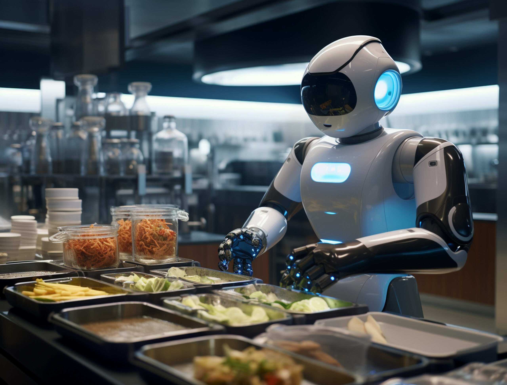

# Advanced Data Analytics for High-Value Food Processing – Professional Level

## 📂 Workshop Slides Quick Links

| Topic / Module | Presentation Slides |
| :--- | :--- |
| **1. Introduction to AI** | 📄 [Introduction to AI](0_CourseOverview/IntroToAI.pdf) |
| **2. Prompt Engineering** | 📄 [Prompt Engineering, RAG & Agentic Workflow](1_PromptEngineering/slides/PromptEng_RAG_Agentic.pdf) 📄 [LangChain and LangGraph](1_PromptEngineering/slides/LangChain_LangGraph.pdf) |
| **3. Codex** | 📄 [Codex](2_Codex/slides/Codex.pdf) |
| **4. NotebookLM** | 📄 [NotebookLM](3_NotebookLM/NotebookLM.pdf) |

---

## 🛠️ Setup & Manuals

| Item | Manual |
| :--- | :--- |
| OpenAI API Key |  |
| Groq API Key |  |
| Codex / Ultralytics |  |

---

## 1. Prompt Engineering

1. Prompt Engineering [`API-LangChain`]: 
2. RAG [`API-LangChain`]: 
3. Agentic Workflow [`API-LangChain-LangGraph`]: 
4. Prompt Pack for Web Version (ChatGPT): 

## 2. Agentic AI with Codex

1. Attachment: [Download Codex Lab Attachments (.zip)](https://raw.githubusercontent.com/pvateekul/iris-subject1/main/2_Codex/assets/codex_lab_attachments.zip)
2. Codex Lab Sheet 

## 3. NotebookLM

1. NotebookLM Lab Sheet 

## 4. Ultralytics (YOLO)

1. Model evaluation image detection with YOLO (Ultralytics Hub) : 

2. Image detection with YOLO (Ultralytics) : 

3. No-code Version : [Slide](https://github.com/pvateekul/iris-subject1/blob/main/4_YOLO/Demo_Ultralytics.pdf)

## Drive 
- Coaching Batch 6: [Link](https://drive.google.com/drive/folders/1Qkpif4lmromQ26oJIhw71w49QsuSNbsD?usp=drive_link)
